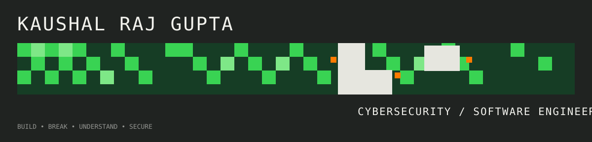
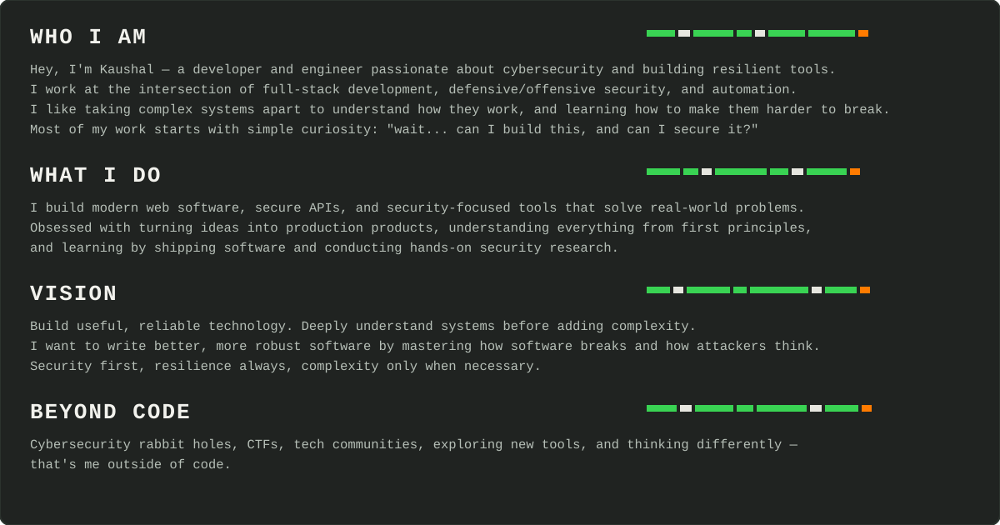
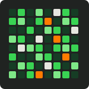
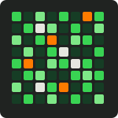
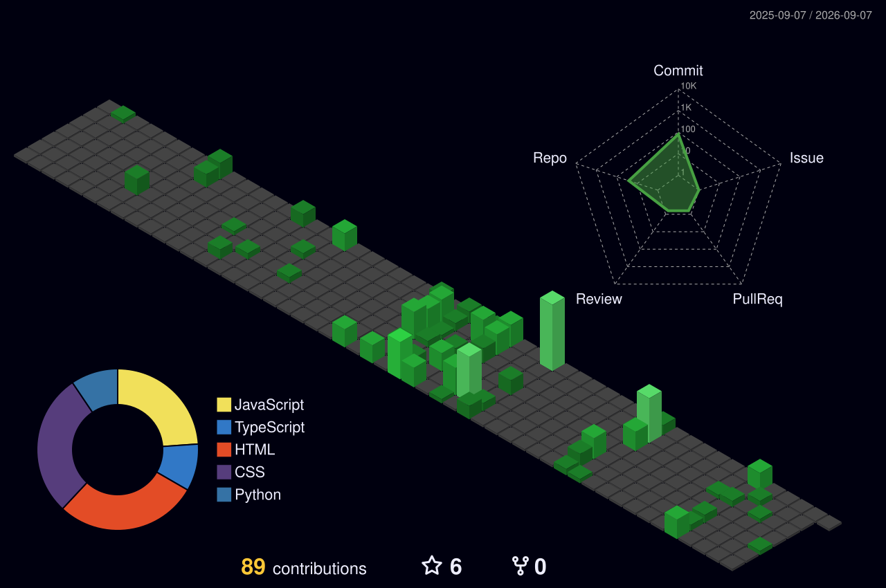
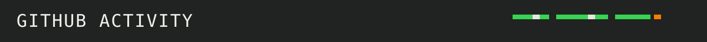

<p align="center">
  
</p>

<p align="center">
  
</p>

<div align="center">
<table border="0" cellspacing="0" cellpadding="0">
  <tr>
    <td width="200" align="center">
      
    </td>
    <td align="center">
      <table border="0" cellspacing="0" cellpadding="8">
        <tr>
          <th>Linkedin</th>
          <th>X (Twitter)</th>
          <th>Gmail</th>
          <th>Website</th>
          <th>GitHub</th>
          <th>TryHackMe</th>
        </tr>
        <tr>
          <td align="center"><br><a href="https://www.linkedin.com/in/kaushalrajgupta" title="Linkedin"></a><br><br></td>
          <td align="center"><br><a href="https://x.com/kaushall44" title="X (Twitter)"></a><br><br></td>
          <td align="center"><br><a href="mailto:kaushalrajgupta44@gmail.com" title="Gmail"></a><br><br></td>
          <td align="center"><br><a href="https://kaushalrajgupta.is-a.dev" title="Website"></a><br><br></td>
          <td align="center"><br><a href="https://github.com/Kaushall44" title="GitHub"></a><br><br></td>
          <td align="center"><br><a href="https://tryhackme.com" title="TryHackMe"></a><br><br></td>
        </tr>
      </table>
    </td>
    <td width="200" align="center">
      
    </td>
  </tr>
</table>
</div>

<p align="center">
  
</p>

<p align="center">
  
</p>

<div align="center">
  <table width="100%">
    <!-- ROW 1: Languages & Core Web -->
    <tr>
      <td align="center" width="10%"><br>HTML</td>
      <td align="center" width="10%"><br>CSS</td>
      <td align="center" width="10%"><br>JS</td>
      <td align="center" width="10%"><br>TS</td>
      <td align="center" width="10%"><br>React</td>
      <td align="center" width="10%"><br>C</td>
      <td align="center" width="10%"><br>C++</td>
      <td align="center" width="10%"><br>Python</td>
      <td align="center" width="10%"><br>Java</td>
      <td align="center" width="10%"><br>Node.js</td>
    </tr>
    <!-- ROW 2: Backend, Frameworks & DBs -->
    <tr>
      <td align="center"><br>FastAPI</td>
      <td align="center"><br>Express</td>
      <td align="center"><br>Postgres</td>
      <td align="center"><br>MySQL</td>
      <td align="center"><br>MongoDB</td>
      <td align="center"><br>Supabase</td>
      <td align="center"><br>Redis</td>
      <td align="center"><br>Tailwind</td>
      <td align="center"><br>Next.js</td>
      <td align="center"><br>Vite</td>
    </tr>
    <!-- ROW 3: Cybersecurity, Networking & Pentesting -->
    <tr>
      <td align="center"><br>BurpSuite</td>
      <td align="center"><br>Wireshark</td>
      <td align="center"><br>Nmap</td>
      <td align="center"><br>Metasploit</td>
      <td align="center"><br>Kali Linux</td>
      <td align="center"><br>HTB</td>
      <td align="center"><br>TryHackMe</td>
      <td align="center"><br>Linux</td>
      <td align="center"><br>Bash</td>
      <td align="center"><br>OWASP</td>
    </tr>
    <!-- ROW 4: DevOps, Cloud & Tools -->
    <tr>
      <td align="center"><br>Docker</td>
      <td align="center"><br>Git</td>
      <td align="center"><br>GitHub</td>
      <td align="center"><br>AWS</td>
      <td align="center"><br>Vercel</td>
      <td align="center"><br>Postman</td>
      <td align="center"><br>Selenium</td>
      <td align="center"><br>VS Code</td>
      <td align="center"><br>Markdown</td>
      <td align="center"><br>Figma</td>
    </tr>
  </table>
</div>

<p align="center">
  
</p>

<p align="center">
  
</p>

<div align="center">
<table width="100%">
<tr>
<td width="50%">

### 🔐 Security Lab
Offensive & defensive security experiments, vulnerability research, penetration testing, and secure system design.

</td>
<td width="50%">

### ⚙️ Software Engineering
Full-stack applications, robust backend architectures, resilient APIs, and developer tooling built from scratch.

</td>
</tr>
<tr>
<td>

### 🤖 AI × Security
Exploring the frontier of LLMs, automated vulnerability analysis, OSINT automation, and smart security pipelines.

</td>
<td>

### 🧪 Build Lab
Rapid prototyping, CTF challenges, open-source tool contributions, and turning 2 AM ideas into working repos.

</td>
</tr>
</table>
</div>

<p align="center">
  
</p>

<p align="center">
  
</p>

<div align="center">

```text
┌──────────────────────────────────────────────────────┐
│                                                      │
│     BUILD IT. BREAK IT. UNDERSTAND IT. SECURE IT.   │
│                                                      │
└──────────────────────────────────────────────────────┘
```

[](https://github.com/Kaushall44)

</div>
